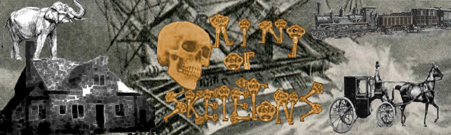

<video src="http://kidsbooksandfun.com/Videos/racoon.mkv" width="320" height="200" controls preload></video>
<video src="http://kidsbooksandfun.com/Videos/racoon3.mp4" width="320" height="200" controls preload></video>
<video src="http://kidsbooksandfun.com/Videos/racoon5.mkv" width="320" height="200" controls preload></video>

      
Magical stories from the Imagination of Dreams
And several from Strange and Unusual Tales to Boggle the Thoughts of the Most Stable Adults

A Special Book
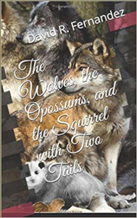

The Wolves the Opposums and the Squirrel with Two Tails

<source src="https://archangelstv.github.io/kidsbooksandfun/Video/cookiemonster.avi" />

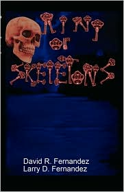  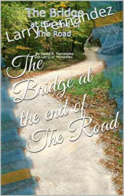 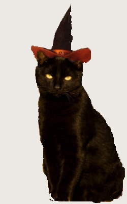

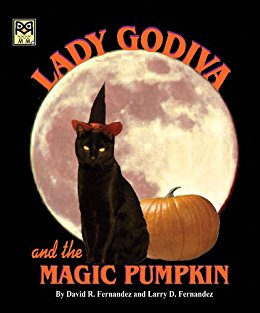 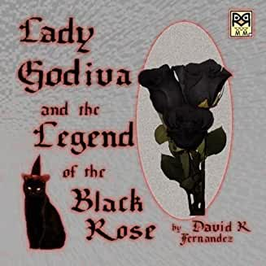 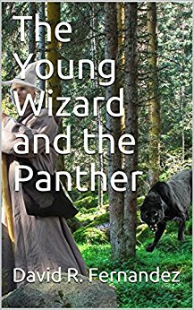 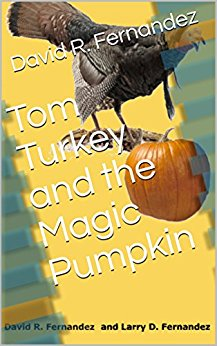 
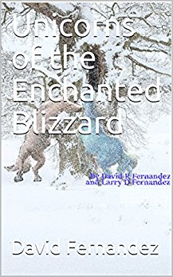   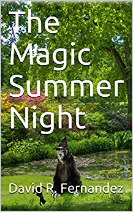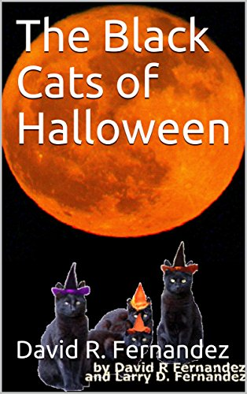
 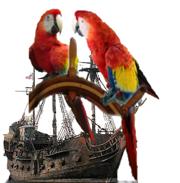 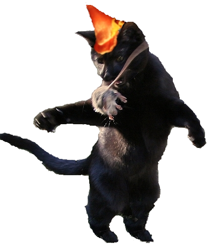
