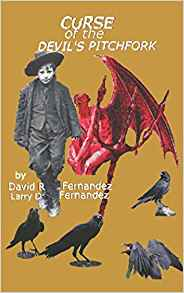

<source src="https://www.kidsbooksandfun.com/C:\Users\lfern\Videos\racoon.flv" />
<video width="560" height="340" preload controls>
<embed type="application/x-vlc-plugin" pluginspage="http://www.kidsbooksandfun.com" target="C:\Users\lfern\Videos\racoonT.flv" />
</video>

<private void btnStart_Click(object sender, EventArgs e)
      {
          try
          {
              LibVlc vlc = new LibVlc();
              vlc.Initialize();
              vlc.VideoOutput = pictureBox1;
              vlc.PlaylistClear();
              string[] Options = { ":sout=#duplicate{dst=display,dst=std {access=udp,mux=ts,dst=224.100.0.1:1234}}" };
              vlc.AddTarget(@"d:\racoon.mp4", Options);
              vlc.Play();
          }
          catch (Exception e1)
          {
              MessageBox.Show($"Error!!! {e}");
          }
      }>
      
Magical stories from the Imagination of Dreams
And several from Strange and Unusual Tales to Boggle the Thoughts of the Most Stable Adults

A Special Book

The Wolves the Opposums and the Squirrel with Two Tails

   

    
   
  
