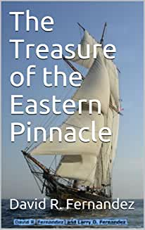

<object width="400" height="224" >
<param name="allowfullscreen" value="true" />
<param name="allowscriptaccess" value="always" />
<param name="movie" value="https://www.kidsbooksandfun.com/Video/racoon.mp4" />
<embed src="https://www.kidsbooksandfun.com/Video/racoon.mp4" type="application/x-shockwave-flash"
allowscriptaccess="always" allowfullscreen="true" width="400" height="224">
</embed>
</object>

<video width="320" height="240" controls>
<source src=https://kidsbooksandfun.com/C:\Users\lfern\Videos\racoon.mp4" type="video/mp4">
</video> 
      
Magical stories from the Imagination of Dreams
And several from Strange and Unusual Tales to Boggle the Thoughts of the Most Stable Adults

A Special Book

The Wolves the Opposums and the Squirrel with Two Tails

   

    
   
  
